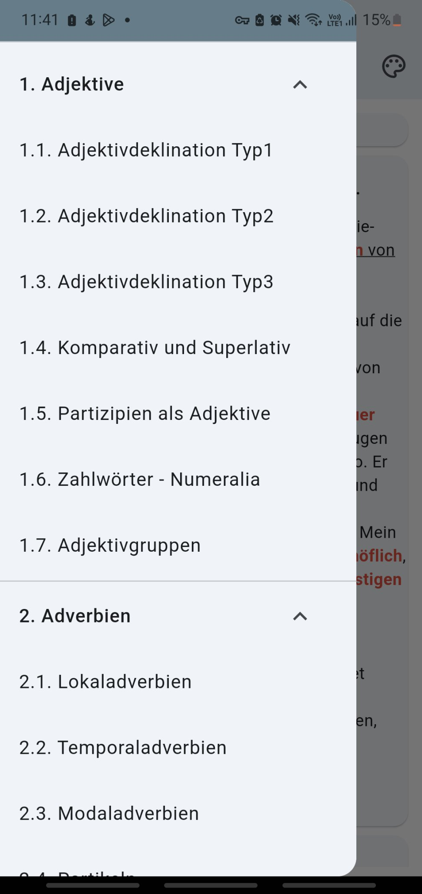

# german_grammar

This application compiles the contents of German grammar from the website https://mein-deutschbuch.de/

## Overview

    <table>
        <tr>
            <td style="text-align: center">
                
            </td>            
            <td style="text-align: center">
                
            </td>
            <td style="text-align: center">
                
            </td>
        </tr>
    </table>

### Support us
We hope this application will be useful for you.

If you’re able to, consider upgrading to the paid version of the software or buying us a cup of coffee. Your support goes a long way in helping us continue to develop and improve the app. Thank you!

